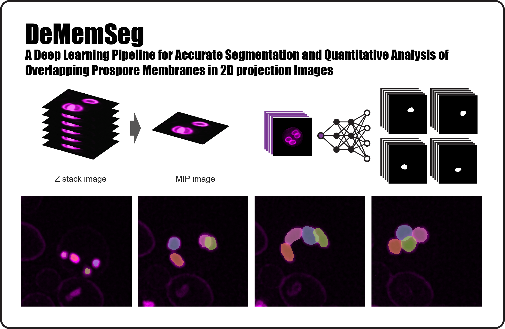

# DeMemSeg: Deep Learning Pipeline for Segmentation and Quantification of Overlapping Membranes in 2D Image


## Overview
This repository provides a comprehensive pipeline, DeMemSeg, designed for the quantitative analysis of overlapping prospore membranes (PSMs) in sporulating yeast cells. The tools and scripts included facilitate:
- Cropping individual yeast cells from 2D Maximum Intensity Projection (MIP) images derived from fluorescently labeled membrane stacks.
- Segmenting the PSM within these cropped single-cell images using a custom-trained Mask R-CNN model.
- Analyzing the shape and morphological characteristics of the segmented PSMs and visualizing the results.

DeMemSeg was developed to address the challenge of accurately segmenting overlapping PSMs, a common issue in 2D projected images.

## Hardware Requirements
- **GPU**: NVIDIA GPU with CUDA support is essential for model training and inference (tested on RTX 3060, VRAM 8GB).
- **Storage**: Sufficient disk space for raw images, processed data, and model checkpoints.

## Software Prerequisites
This project relies on specific versions of GPU-accelerated libraries (CUDA, cuDNN, PyTorch, etc.) for its deep learning components. Manual configuration of these dependencies can be complex and prone to compatibility issues. **Therefore, the use of Docker is strongly recommended to ensure a reproducible and correctly configured environment.**

### Using Docker (Recommended)
Docker encapsulates the entire software environment, including all libraries and dependencies, within a container. This approach guarantees that DeMemSeg runs as intended, regardless of your local system configuration.
- If you are new to Docker, please refer to the [official Docker documentation](https://docs.docker.com/get-started/) for installation instructions suitable for your operating system.

### For Windows Users
Windows users should utilize **WSL2 (Windows Subsystem for Linux 2)** with a compatible Linux distribution (e.g., Ubuntu 20.04 LTS or later). WSL2 provides a robust Linux environment on Windows that fully supports Docker and GPU acceleration.
- For Docker installation on WSL2, see the [Docker Desktop WSL 2 backend documentation](https://docs.docker.com/desktop/wsl/).

---
<br>

## Setup and Installation

### Building and Running the Docker Container
1.  **Clone the Repository**:
    ```bash
    git clone https://github.com/shoda6/DeMemSeg.git
    cd DeMemSeg
    ```
2.  **Build the Docker Image**:
    Navigate to the root directory of the cloned repository (where the `Dockerfile` is located) and run:
    ```bash
    docker build -t dememseg-env:latest .
    ```
    This command builds a Docker image named `dememseg-env` with the tag `latest` using the provided `Dockerfile`.

3.  **Run the Docker Container**:
    Once the image is built, run the container using:
    ```bash
    docker run -it --name dememseg_container --gpus all -v "$(pwd)":/workspace -p 8888:8888 dememseg-env:latest
    ```
    - `-it`: Runs the container in interactive mode with a pseudo-TTY.
    - `--name dememseg_container`: Assigns a name to your container for easier management.
    - `--gpus all`: Enables GPU access within the container (requires NVIDIA Container Toolkit).
    - `-v "$(pwd)":/workspace`: Mounts the current directory (your cloned DeMemSeg repository) into the `/workspace` directory inside the container. This allows you to edit files locally and have changes reflected in the container, and for outputs from the container to be saved on your host machine.
    - `-p 8888:8888`: Maps port 8888 of the container to port 8888 on your host machine, useful for accessing Jupyter notebooks running inside the container.
    - `dememseg-env:latest`: Specifies the image to run.

4.  **Accessing the Container and Setting up the Python Environment (Optional, if not handled by Docker entrypoint)**:
    You can access a terminal within the running container using:
    ```bash
    docker exec -it dememseg_container bash
    ```
    Once inside the container, if a Python virtual environment is preferred or required by the `install.sh` script:
    ```bash
    # Navigate to the workspace if not already there
    cd /workspace 
    
    # If the .venv_DeMemSeg directory is not present or you want to re-create the environment
    bash install.sh 
    ```
    This script should set up the Python virtual environment (`.venv_DeMemSeg`) and install all necessary Python packages listed in `requirements.txt`. *Ensure your `install.sh` script correctly creates and activates this virtual environment and installs dependencies.*

## Running the DeMemSeg Workflow
The primary workflow is orchestrated through a Jupyter Notebook.

1.  **Prepare Input Images**:
    * Place your 2D MIP fluorescence images of yeast cells (e.g., TIFF files) into a designated input directory. For demonstration, sample images are provided in `demo_images/`.
    * The current pipeline is optimized for images with characteristics similar to those described below (see "Microscopy Image Specifications").

2.  **Configure Parameters in the Main Notebook**:
    * Start a Jupyter Notebook server from within the Docker container's terminal (if not already started):
      ```bash
      # Ensure you are in the /workspace directory and the virtual environment is activated
      # source .venv_DeMemSeg/bin/activate (if applicable)
      jupyter notebook --ip=0.0.0.0 --port=8888 --allow-root --no-browser
      ```
    * Open your web browser on your host machine and navigate to the URL provided by Jupyter (usually `http://localhost:8888/` or `http://127.0.0.1:8888/`, with a token).
    * Open the main workflow notebook: `./notebooks/main_DeMemSeg.ipynb`. *(Corrected path from ./notebook to ./notebooks/ based on Repository Structure)*
    * **Crucially, modify the parameters within the notebook, especially paths to your input image directory and desired output directories.** Refer to the example paths and comments within the notebook (e.g., using `demo_images/` for input).
    * Ensure the Jupyter Notebook is using the Python kernel associated with the `.venv_DeMemSeg` virtual environment (if created).

3.  **Execute the Notebook**:
    * Run all code cells in the `main_DeMemSeg.ipynb` notebook sequentially. This will typically perform:
        * Cell cropping using the custom CellPose model.
        * PSM segmentation using the DeMemSeg (Mask R-CNN) model.
        * *(Optional, if included)* Morphological analysis and visualization generation.

4.  **Locate and Inspect Results**:
    * Segmented images, instance masks, and associated information (e.g., JSON files with coordinates/scores) will be saved to the output directory specified in the notebook. An example output structure might be within `/workspace/output/` or a similar directory relative to the repository root (e.g., `/workspace/output/Project_Name/Experiment_Name/segmented_images/`). *Please provide a clear example or default output path structure.*
    * *(Optional, if included)* Analysis results, such as CSV files or figures, will be saved in the `figure/` or `data/output/` directory as configured in the notebook/scripts.

## DeMemSeg Input Format
The DeMemSeg workflow begins with CellPose using 8-bit depth, RGB color images with a resolution of 2048x2048 pixels. While your microscopy specifications may differ, you can adapt the pipeline by training your own custom CellPose model. Once trained, provide the file path to your model, and the remaining DeMemSeg workflow can be executed as `main_DeMemSeg.ipynb`.
**Note**: The required input format for the MMdetection-based segmentation model is 200x200 pixel images.

## Running SAM 2
If you are interested in running SAM 2, please refer to the SAM 2 GitHub repository: https://github.com/facebookresearch/sam2
Our script and prompt for SAM2 are in `notebook/SAM2_PSM.ipynb`.


## Microscopy Image Specifications (Recommended for Optimal Performance)
DeMemSeg was trained and validated on images with the following characteristics:
- **Yeast Strain**: SK1 diploid expressing mCherry-Spo20⁵¹⁻⁹¹ (PSM marker).
- **Microscope System**: Leica THUNDER Imager Live Cell.
- **Objective**: 100x oil immersion (NA 1.4).
- **Raw Acquisition**: Z-stacks (40-50 slices, 0.21 µm intervals).
- **Preprocessing**: Computational clearing followed by Maximum Intensity Projection (MIP).
- **Input Image Format for DeMemSeg**: 2D MIP images.
- **Image Resolution (approx.)**: 2048x2048 pixels for the original field of view. Cropped single-cell images are 200x200 pixels.
- **Bit Depth (input to model)**: 8-bit (e.g., scaled TIFF or PNG).

## Repository Structure
- **`data/`**: May contain demo input images and, if analysis scripts are included, storage for input/output CSV files for morphological analysis.
- **`demo_images/`**: (Recommended) A small set of example input images to test the pipeline.
- **`docker/`**: Contains the `Dockerfile` and potentially other Docker-related setup files.
- **`docs/`**: (Optional) For more detailed documentation, figures for README.
- **`notebooks/`**: Jupyter notebooks, including `main_DeMemSeg.ipynb` for running the end-to-end workflow and potentially others for specific analyses or model training.
- **`output/`**: (Recommended) Default directory for saving processing results (cropped images, segmentations, analysis data). Add this to `.gitignore` if results are not meant to be versioned.
- **`src/`**: Contains Python source code for DeMemSeg, utility scripts. Includes `GraphicalAbst.png`.
- **`models/`**: Pre-trained model weights for CellPose (custom) and DeMemSeg (Mask R-CNN).
- **`scripts/`**: *(Optional, if R scripts are separate from notebooks)* R scripts for downstream data processing or visualization.
- **`install.sh`**: Shell script for setting up the Python virtual environment and installing dependencies within the Docker container.
- **`requirements.txt`**: List of Python package dependencies.
- **`LICENSE`**: Project license file (MIT).
- **`README.md`**: This file.

## Citation
If you use DeMemSeg or this repository in your research, please cite our publication:

> [Shodai Taguchi, Keita Chagi, Hiroki Kawai, Kenji Irie, Yasuyuki Suda, Department of Molecular Cell Biology in University of Tsukuba and Science group in LPIXEL Inc.]. (2025). DeMemSeg: A Deep Learning Pipeline for Accurate Segmentation and Quantitative Analysis of Overlapping Prospore Membranes in 2D Projection Images. *Cell Structure and Function*, Vol(Issue), Pages. DOI: [Insert DOI when available]

## License
This project is licensed under the MIT License. See the `LICENSE` file for details.

## Contact
For questions, issues, or contributions, please open an issue on this GitHub repository or contact [taguchi.shodai.td@gmail.com](mailto:taguchi.shodai.td@gmail.com).

